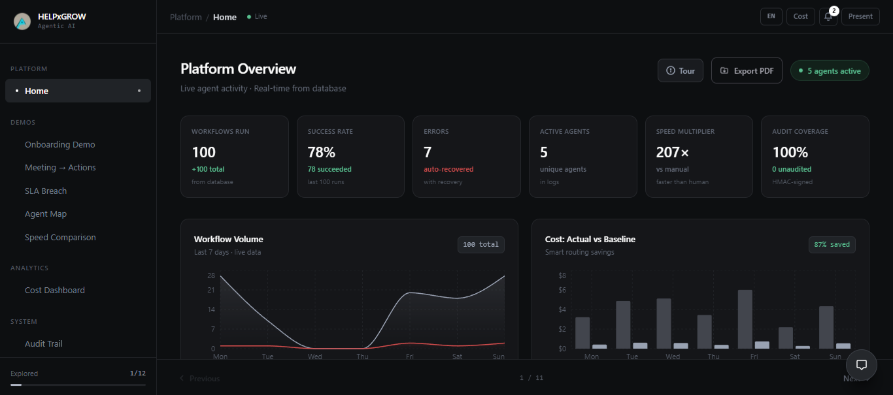
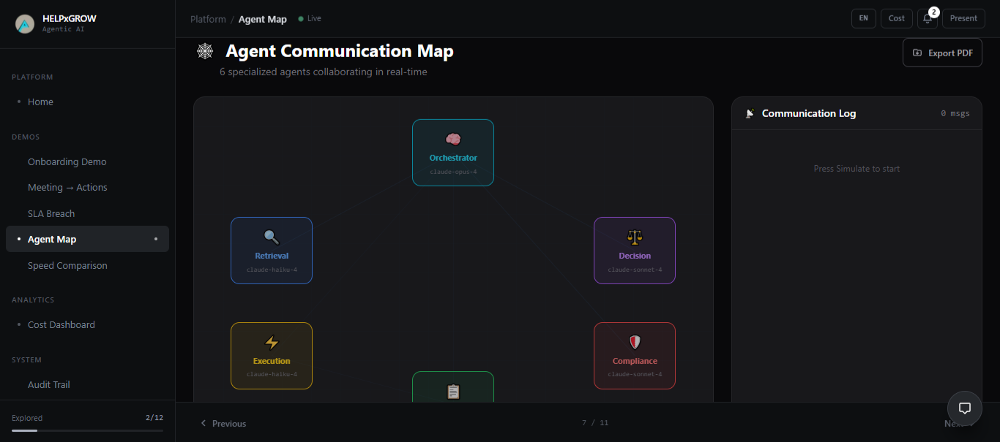
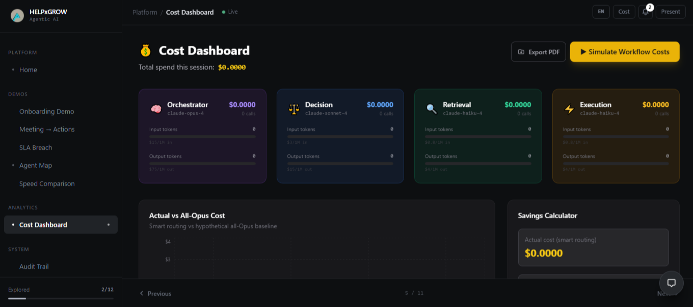
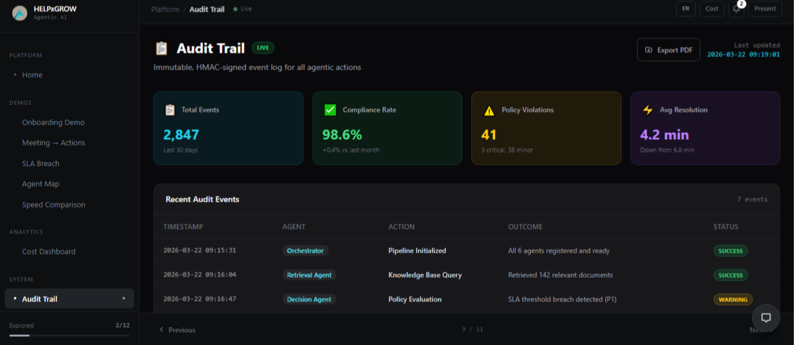

<div align="center">


<h1>HelpXGrow </h1>

<p><strong>HelpXGrow is an Agentic AI platform that streamlines enterprise operations through autonomous multi-agent workflows, real-time analytics, and intelligent process automation.</strong><br/>


[](https://helpxgrow-venda60.public.builtwithrocket.new)
[](https://nextjs.org/)
[](https://react.dev/)
[](https://www.typescriptlang.org/)
[](https://tailwindcss.com/)
[](LICENSE)
[](CONTRIBUTING.md)

<br/>

[🌐 Live Demo](https://helpxgrow-venda60.public.builtwithrocket.new) 

</div>


## 🌟 Overview

HelpXGrow is an Agentic AI platform for autonomous enterprise workflows. It uses a multi-agent architecture to manage onboarding, meeting actions, and SLA monitoring with minimal human intervention, featuring real-time analytics, audit trails, and self-correcting processes.
Whether you're here to use it, learn from it, or contribute to it — you're in the right place.


---

## 🚀 Live Demo

| Platform | Link |
|----------|------|
| 🌐 Live Application | [helpxgrow-venda60.public.builtwithrocket.new](https://helpxgrow-venda60.public.builtwithrocket.new) |

---

## ✨ Features

- ⚡ **Next.js 15** — App Router, Server Components, and improved performance out of the box
- ⚛️ **React 19** — Latest React with enhanced capabilities and concurrent features
- 🎨 **Tailwind CSS** — Utility-first styling for rapid, responsive UI development
- 🔷 **TypeScript** — Full type safety for a robust, maintainable codebase
- 📱 **Fully Responsive** — Optimized for all screen sizes and devices
- 🧩 **Modular Architecture** — Clean, reusable component structure
- 🛠️ **Developer Experience** — ESLint, Prettier, and PostCSS pre-configured

---
<h2 align="center">Platform Features Overview</h2>
<p align="center"><i>A visual guide to the main views and interfaces within the application.</i></p>

<h3 align="center">Dashboard</h3>
<p align="center">The main operational workspace displaying central system metrics, statistics, and platform performance data.</p>
<p align="center">
  
</p>

<br />

<h3 align="center">Agent-map</h3>
<p align="center">A visual interface showing the network map, communication pathways, and connections between active system components.</p>
<p align="center">
  
</p>

<br />

<h3 align="center">Cost-dashboard</h3>
<p align="center">The analytics view tracking resource consumption, financial expenditures, and budget metrics over time.</p>
<p align="center">
  
</p>

<br />

<h3 align="center">Audit-trail</h3>
<p align="center">A chronological security log tracking system events, user actions, and validation records for compliance.</p>
<p align="center">
  
</p>

---

## 🛠️ Tech Stack

| Category | Technology |
|----------|-----------|
| Framework | [Next.js](https://nextjs.org/) |
| UI Library | [React](https://react.dev/) |
| Language | [TypeScript](https://www.typescriptlang.org/) |
| Styling | [Tailwind CSS](https://tailwindcss.com/) |
| Linting | [ESLint](https://eslint.org/) |
| Formatting | [Prettier](https://prettier.io/) |
| CSS Processing | [PostCSS](https://postcss.org/) + [Autoprefixer](https://github.com/postcss/autoprefixer) |

---

## 📁 Project Structure

```
helpxgrow/
├── public/                  # Static assets (images, icons, fonts)
│   ├── favicon.ico
│   └── assets/       
│       ├── Dashboard.png
│       ├── Agent-map.png
│       ├── Cost-dashboard.png
│       └── Audit-trail.png
├── src/
│   ├── app/                 # App Router — pages and layouts
│   │   ├── layout.tsx       # Root layout (applies to all pages)
│   │   ├── page.tsx         # Home page component
│   │   └── [...routes]/     # Additional route segments
│   ├── components/          # Reusable UI components
│   │   ├── ui/              # Base UI primitives (buttons, inputs, etc.)
│   │   └── shared/          # Shared layout components (header, footer)
│   ├── styles/              # Global styles and Tailwind configuration
│   └── lib/                 # Utility functions and helpers
├── .env.example             # Example environment variables
├── .gitignore               # SPECIFIES WHICH FILES GIT SHOULD IGNORE (node_modules, .env, etc.)
├── README.md                # YOUR MAIN REPOSITORY DOCUMENTATION
├── next.config.mjs          # Next.js configuration
├── tailwind.config.js       # Tailwind CSS configuration
├── postcss.config.js        # PostCSS configuration
├── tsconfig.json            # TypeScript configuration
└── package.json             # Project dependencies and scripts
```


> **New to web development?** Don't worry — follow the [Quick Setup] guide below and you'll be running the project in under 5 minutes
## ⚡ Quick Start
 
**Prerequisites:** Node.js 18+, Git
 
```bash
# 1. Clone and enter the project
git clone https://github.com/your-username/helpxgrow.git
cd helpxgrow
 
# 2. Install dependencies
npm install
 
# 3. Set up environment variables
cp .env.example .env.local
# Open .env.local and fill in your values
 
# 4. Start the dev server
npm run dev
```
 
Open [http://localhost:4028](http://localhost:4028) — you're good to go.
 
> **Something not working?** See the [Troubleshooting](#-troubleshooting) section.
 
---
 
### 🔑 Environment Variables
 
```env
# .env.local
 
NEXT_PUBLIC_APP_URL=http://localhost:4028
NEXT_PUBLIC_APP_NAME=HelpXGrow
 
# DATABASE_URL=
# NEXTAUTH_SECRET=
```
 
> Never commit `.env.local` — it's already in `.gitignore`.
 
---
 
### 🚢 Deployment
 
**Vercel (recommended)** — connects to your GitHub repo and deploys on every push:
 
[](https://vercel.com/new/clone?repository-url=https://github.com/your-username/helpxgrow)
 
**Manual build:**
 
```bash
npm run build
npm run serve
```
 
| Platform | How |
|----------|-----|
| [Vercel](https://vercel.com) | Auto-deploy on Git push |
| [Netlify](https://netlify.com) | Connect GitHub repo |
| [Railway](https://railway.app) | Deploy via CLI |
| [Docker](https://docker.com) | Use the included `Dockerfile` |


---

## 📜 Available Scripts

| Command | Description |
|---------|-------------|
| `npm run dev` | Start the development server on port **4028** |
| `npm run build` | Build the optimized production bundle |
| `npm run start` | Start the development server |
| `npm run serve` | Start the production server (run `build` first) |
| `npm run lint` | Check code quality with ESLint |
| `npm run lint:fix` | Automatically fix lint issues |
| `npm run format` | Format all files with Prettier |

---
## 🔧 Troubleshooting

<details>
<summary><strong>❌ `npm install` fails</strong></summary>

- Make sure Node.js version is **18 or later**: `node -v`
- Try deleting `node_modules` and `package-lock.json`, then run `npm install` again:
  ```bash
  rm -rf node_modules package-lock.json
  npm install
  ```
</details>

<details>
<summary><strong>❌ Port 4028 is already in use</strong></summary>

Kill the process using the port:
```bash
# On Mac/Linux
kill -9 $(lsof -ti:4028)

# On Windows (PowerShell)
Stop-Process -Id (Get-NetTCPConnection -LocalPort 4028).OwningProcess -Force
```
Or run on a different port:
```bash
npm run dev -- -p 3001
```
</details>

<details>
<summary><strong>❌ TypeScript errors on startup</strong></summary>

Run the TypeScript compiler check:
```bash
npx tsc --noEmit
```
Fix any reported errors, or open an [issue](../../issues) if you think it's a bug.
</details>

<details>
<summary><strong>❌ Styles not applying / Tailwind not working</strong></summary>

Make sure `tailwind.config.js` includes your files in the `content` array:
```js
content: ["./src/**/*.{js,ts,jsx,tsx,mdx}"]
```
Then restart the dev server.
</details>

---

## 🤝 Contributing
### Contribution Guidelines

* Keep pull requests focused on a single feature, fix, or improvement.
* Follow the existing code style and project conventions.
* Run linting checks before submitting changes.
* Write clear and descriptive commit messages.
* For major changes or new features, open an issue first to discuss the proposed approach.
* Be respectful and constructive when collaborating with other contributors.

### Contribution Areas

HelpXGrow welcomes contributions across different parts of the project:

| Area | What you can work on |
|------|----------------------|
| Frontend | UI/UX improvements, responsive design, component development |
| Features | Enhancements to existing functionality and user experience |
| Quality & Testing | Bug fixes, accessibility improvements, and performance optimization |
| Documentation | README improvements, setup guides, and contributor resources |
| Project Maintenance | Code cleanup, refactoring, and developer experience improvements |

### Good First Issues

New to open source? Look for issues tagged:

[](../../issues?q=is%3Aopen+is%3Aissue+label%3A%22good+first+issue%22)
[](../../issues?q=is%3Aopen+is%3Aissue+label%3A%22help+wanted%22)


---

## 👥 Contributors

Thanks to everyone who has contributed to HelpXGrow! 🙌

<p align="center">
  <a href="https://github.com/Krish260653/helpxgrow/graphs/contributors">
    
  </a>
</p>


---


## 📄 License

This project is licensed under the **MIT License** — see the [LICENSE](LICENSE) file for details.


---

## Support

HelpXGrow is an open-source project, and community contributions play an important role in its growth and improvement.

You can support the project by:

* Starring the repository
* Reporting bugs and issues
* Suggesting new features
* Contributing code or documentation
* Reviewing and testing pull requests
* Sharing the project with your network

Every contribution, whether technical or non-technical, helps improve the experience for users and contributors alike.

Thank you for supporting HelpXGrow.


<div align="center">

Built with ❤️ by the HelpXGrow community


</div>
